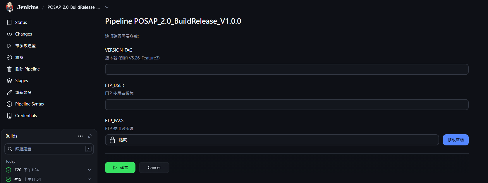
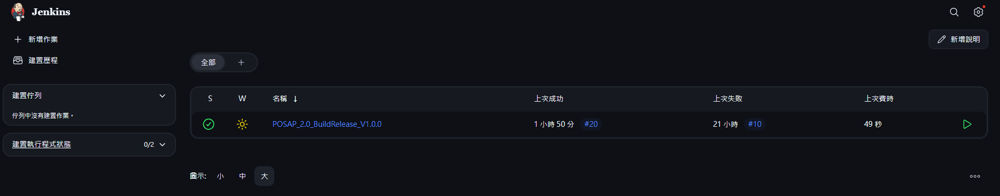
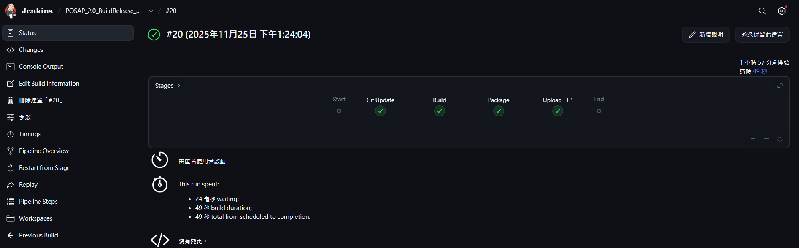
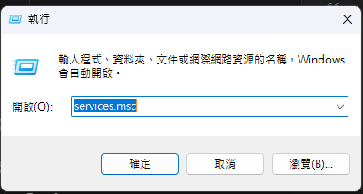
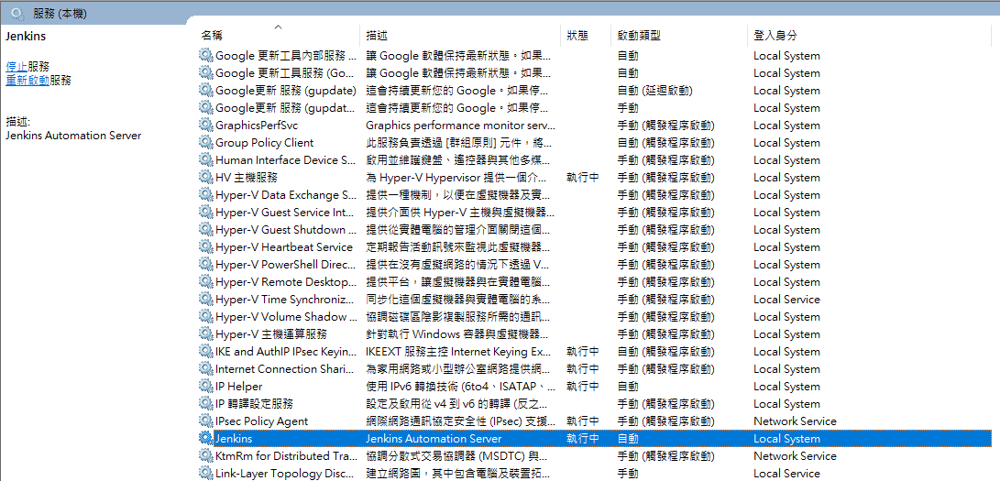
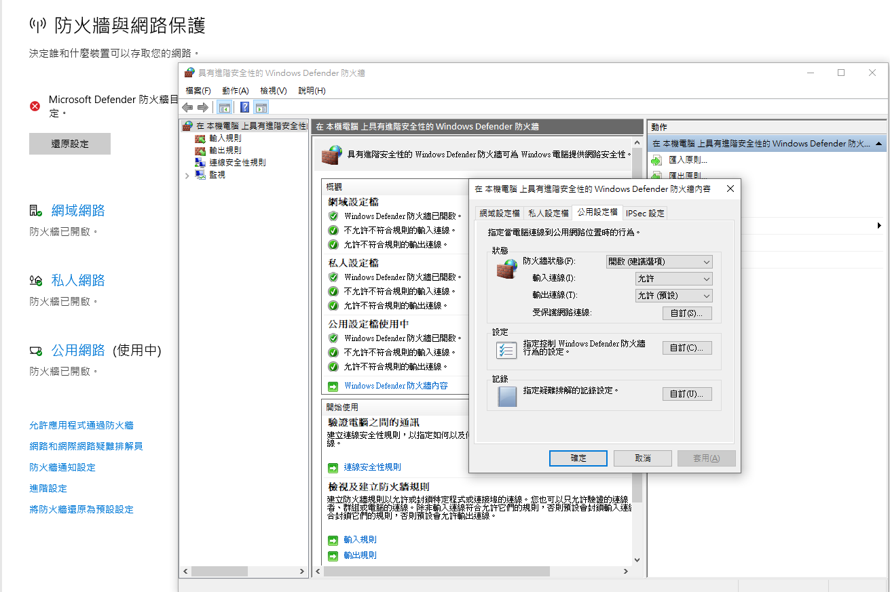

# Jenkins_BuildRelease

Jenkins 部署 POS 2.0（點餐通 2.0）用的建置 / 打包腳本專案。  
目標：在 Jenkins 上 **完成建置、打包、上傳 FTP** 的流程，減少人工操作與環境依賴問題。


---

## 功能簡介

1. **讀取 `.env` 設定**
   - 包含專案建置路徑、輸出路徑、FTP 目錄等固定參數。

2. **建置專案（Build）**
   - 還原 NuGet 套件。
   - 呼叫 MSBuild 建置 WPF Solution（例如 `點餐通_併版.sln`）。

3. **打包發布檔（Release / Package）**
   - 清空 `Release` 資料夾舊檔。
   - 將建置輸出複製到 `Release` 路徑。
   - 依照版本建立 `POSAP_UpdateYYMMDD[_序號]` 資料夾。
   - 壓縮成 `POSAP.zip`。

4. **上傳 FTP**
   - 使用 Jenkins 輸入的 FTP 帳號密碼，上傳壓縮檔到指定路徑。
   - 目標目錄結構：`/Test/02. 點餐通2.0/<VERSION_TAG>/POSAP_UpdateYYMMDD.../POSAP.zip`

   
---

## 環境需求
需確認是否符合POS 2.0開發環境，可參考[RD開發環境相關資訊](https://docs.google.com/document/d/1zhbPoj11szoKTEo_j9j8TiZ66-VIS5X192Kkun7N6kk/edit)

### 檔案路徑與服務連結
- Jenkins服務連結
    => [192.168.17.108:8080](http://192.168.17.108:8080/)
- POSAP建置路徑 **(勿刪)**
    => C:\Users\Administrator\Desktop\POSAP_Project
- Jenkins指令檔案路徑 **(勿刪)**
    => D:\POSAP_BuildScripts
- Jenkins打包輸出資料夾路徑 **(勿刪)**
    => D:\POSAP_Release
- ftp 固定路徑 (參數輸入的版本號會附加在後面)
    => /Test/02. 點餐通2.0

## 輸入參數說明
- 版本號
    - 包含要建置哪一個版本，輸入的版本號以Develop為主，目前為固定路徑
    => 例如: 輸入V5.27，則Jenkins會去GitTea上取的origin/Develop/V5.27此分支，並將此版本建置
- ftp帳號密碼




## 使用流程

開啟Jenkins服務連結後：

1. **點選要執行的建置作業**


2. **選擇帶參數建置**


3. **執行成功即完成打包上傳**



---

## 常見問題(FAQ)

### 1. Jenkins服務連結無法開啟
* 請按下 `win + r` 並輸入 `services.msc` 按下 `Enter`



* 確認是否有Jenkins服務正在執行
若沒有列出則表示服務目前未安裝

Jenkins服務執行中，如下圖所示



**如發現被關閉則按下右鍵並按下啟動即可**

### 2. NuGet/MSBuild建置失敗
* 請確認是否有依照**環境需求**的流程設定，或是尚未安裝Visual Studio 2022

### 3. ftp上傳失敗
* 請確認防火牆是否有允許連線

如下圖所示



* 請確認由Jenkins輸入的帳號密碼是否正確

* 請確認ftp帳號密碼之權限

### 4. 分支切換失敗
* 為保持正確且最新的狀態，Jenkins會重新拉取遠端分支，因此須注意
    - 本地端是否還有相關變更未上傳(POS-SERVER理應不能拿來開發)
    - 請確認遠端是否有輸入之目標分支 => (目前建置版本 `POSAP_2.0_BuildRelease_V1.0.0` 僅支援Develop內相關分支的建置)
    - POS-SERVER上的GitTea是否尚未登入

---

## 重點提醒

### 為避免Jenkins出現錯誤，請盡量避免變更或編輯以下路徑或連結

```text
D:\POSAP_Release
C:\Users\Administrator\Desktop\POSAP_Project
ftp路徑
